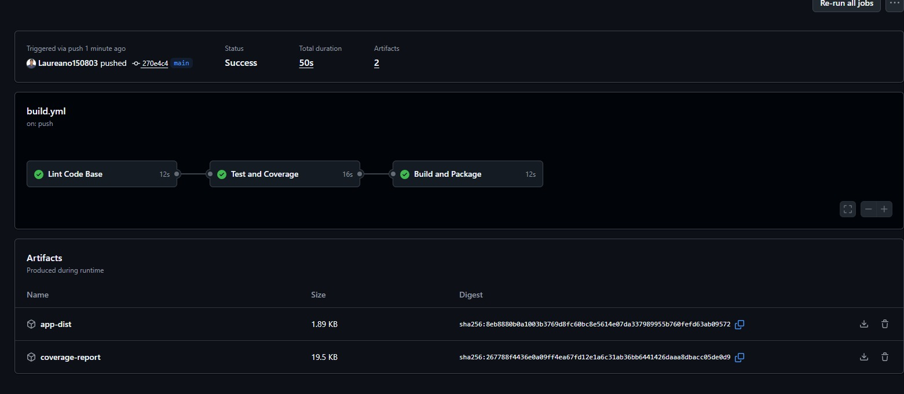
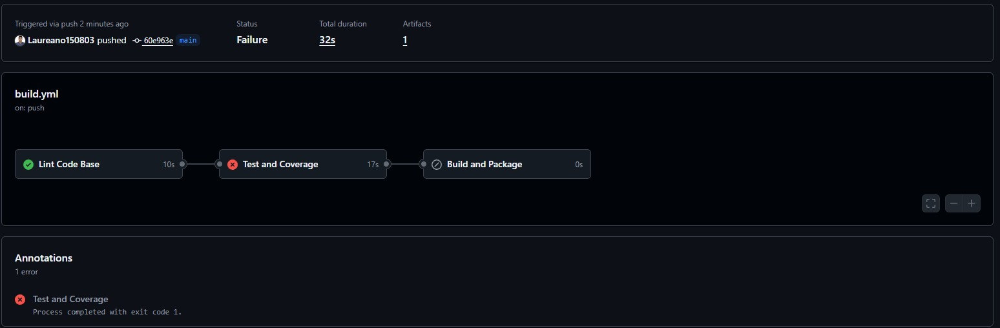
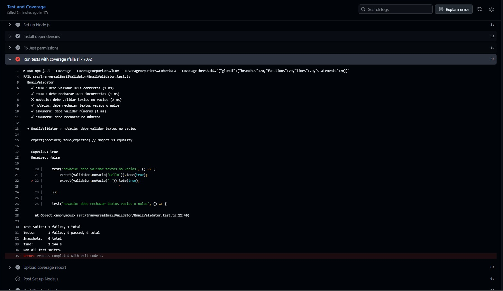

integrante: Laureano Hurtado

# estructura del pipeline

Los pipelines se ejecutan bajo las directrices de Github actions, el orden es Lint, ejecucion de Test con validacion de coverage y generacion de artefacto de testing unitario, y por ultimo el Build de la aplicacion.

# Evidencias de fallo y acierto en pipelines

Success

failed

