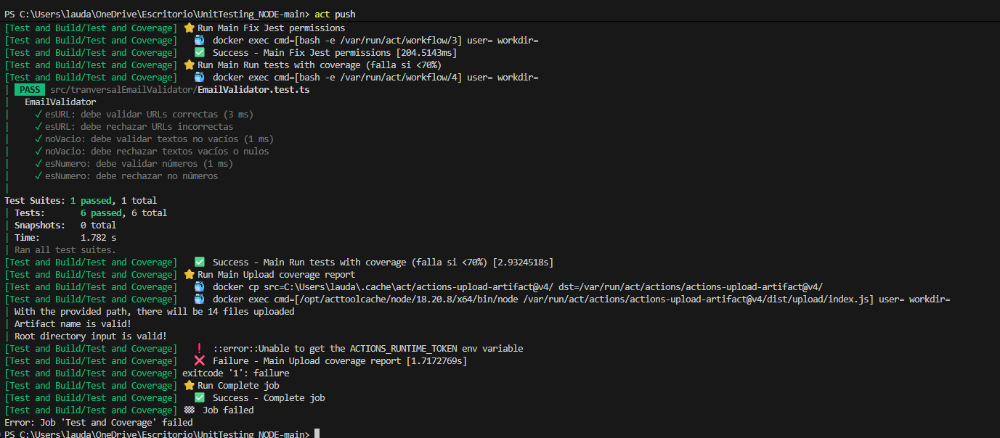

# Respuestas parte 1

diferencia entre CI y CD.
1. CI - integracion continua

es un proceso que tiene como fin que cada vez que se intente subir codigo al proyecto se hagan las validaciones necesarias para favorecer a la calidad del proyecto, las validaciones podrian ser:

Ejecucion de test
Codigo compilable
Validar calidad del codigo
Generar reportes

CD - Entrega continua

La idea de este proceso es que la app se prepare para desplegarse pero que el despliegue final lo aprube un humano, es decir, la app ya esta construida(built) para ser desplegada.

2. Leguaje del ejercicio: Typescript, linter:ESlint, herramienta de cobertura: Jest

Justificacion: Son herramientas muy accesibles, se requiere poca configuracion a la hora de implementarlas.

3. Umbral de cobertura para el ejercicio : 70%

# parte 2
***IMPLEMENTADA EN EL CODIGO***

# parte 3

Que es act?

Es una herramienta que nos permite simular las github actions en nuestro entorno local mediante una imagen Docker

ejercicio: comando <<act push>> para simular un push

# parte 4

1. 

**Cómo identificar fallos de Linter**

Los logs muestran errores de ESLint con archivo, línea y regla violada.

Mensajes típicos: "ESLint found X errors", "Parsing error", o "no-unused-vars".

El job falla con un código exit 1.

**Cómo identificar fallos de Pruebas**

El log contiene la palabra FAIL.

Se muestra qué test falló, la expectativa y el valor recibido.

Aparecen contadores como "1 failed, 4 passed".

**Cómo identificar fallos de Cobertura**

Jest muestra que la cobertura mínima no se alcanzó.

Mensajes típicos: "coverage threshold not met".

El job se detiene porque la cobertura quedó por debajo del porcentaje requerido.

2.  **Imagenes adjuntas a Readme.md**

La diferencia que provoca el fallo del pipeline de testing es un test mal implementado el cual obtiene una respuesta no esperada. 

# parte 5

**metodos para detectar codigo generado por IA**

Análisis de estilo y patrones: se revisa si el código tiene características típicas de IA, como comentarios demasiado formales, estructuras muy estandarizadas, nombres genéricos de variables o ausencia de errores humanos.

Revisión del proceso de creación: se analiza el historial de trabajo (por ejemplo, commits en Git, tiempos de edición, versiones intermedias) para comprobar si hubo desarrollo progresivo o si el código apareció completo de inmediato.

**por qué no es posible asegurar al 100% la autoría**

Porque se puede modificar ligeramente el codigo generado por IA, lo cual resulta mas complejo de identificar, tambien depende mucho de que tipo de IA se use, por ejemplo, Copilot utiliza codigo ya hecho por otros repositorios o incluso entiende el proposito del trabajo que se hace en tu proyecto.

**Proponer políticas razonables de uso de IA en educación y calidad**

Fomentar el uso responsable de la IA

Es importante que la persona pueda apropiarse de la IA generó

Entender que la IA es una herramienta más, que puede fallar y por eso puede generar sesgos a la hora de estudiar y riesgos a la hora de hacer trabajos delicados, por ende, controlar que tipo de trabajo se le asigna a la IA.